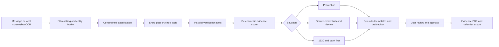

# ScamShield

A working scam triage and recovery preparation app for Indian families. Paste a message, URL, phone or UPI ID, or extract screenshot text on your device. Get a deterministic verdict, supporting evidence, an action plan, editable drafts, a reviewed evidence PDF, and calendar reminders.

**Drafts only. The user submits, calls and shares. No automatic filing, freezing, contact, or guaranteed recovery.**

See [the 14-point security checklist](docs/SECURITY-CHECKLIST.md) and [operations runbook](docs/RUNBOOK.md). Production authentication and auditing fail closed until configured. Native Gemini tool-calling is verified locally. The prototype source is published at [Abhiraj-H/ScamShield](https://github.com/Abhiraj-H/ScamShield). The FA RAG and Vercel update is in this checkout; public runtime deployment remains unverified.

## Quick start

Requires Node.js 24 and Python 3.12+. The web UI and FastAPI service use the **same JavaScript analysis engine**; they do not duplicate scoring logic.

```bash
npm ci --ignore-scripts
npm run build
.venv/bin/python scripts/run-public-demo.py
```

Open http://127.0.0.1:8000 for the complete local rehearsal. The launcher loads ignored `.dev.vars` Gemini settings, creates a private audit signing key when needed, and disables development authentication. Run `npm run dev` in another terminal for frontend hot reload on port 5173; it proxies analysis to the local API on port 8000.

The standalone React/Vite frontend is now the canonical build target. The unavailable Sites deployment and its vinext build adapter have been retired. Existing D1 adapter code and tests remain as reference, but the current build does not publish a Sites worker. Screenshot OCR uses bundled English, Hindi and Marathi Tesseract language data inside the browser, with editable text review before analysis. No screenshot is sent to a provider by this browser flow.

## Independently hosted API

```bash
python3 -m venv .venv
.venv/bin/pip install --require-hashes -r backend/requirements.lock
# Explicit loopback-only development authentication:
SCAMSHIELD_DEV_AUTH=1 .venv/bin/uvicorn backend.main:app --host 127.0.0.1 --port 8000
```

The API has no public Swagger/docs route. Production requires configured OIDC issuer/audience/HTTPS JWKS, an MFA claim and a user/reader/auditor role. Every protected request uses a short-lived bearer token; shared API-key authentication has been removed. Production also requires a vault-provided audit signing key. See `.env.example` and the security checklist. The local-development flag only permits loopback/TestClient access and must remain disabled in every deployed service. Node and the shared npm dependencies must be available. SQLite data is separate from hosted D1.

```bash
curl http://127.0.0.1:8000/analyze \
  -H 'Content-Type: application/json' \
  -d '{"text":"SBI KYC expires tonight. Send OTP at https://sbi-kyc.example","lang":"en","answers":{"paid":true,"amount":5000,"bank":"SBI"}}'
```

### Optional AI and threat-list services

Gemini setup: create a key at https://aistudio.google.com/api-keys, then add the following to the ignored `.dev.vars` file **without replacing its existing audit key**:

```dotenv
LLM_PROVIDER=gemini
GEMINI_API_KEY=your_key_here
GEMINI_MODEL=gemini-3.5-flash-lite
```

Restart the standalone API after changing server settings. For the stateless standalone demo, run `npm run build:demo` then `.venv/bin/python scripts/run-public-demo.py`; its launcher loads these settings from `.dev.vars`. Direct Uvicorn and Docker deployments use runtime environment variables or `GEMINI_API_KEY_FILE` instead. In Vercel, configure these three variables as server environment variables. The key remains server-side. The free tier depends on the Google project/model and its quota, not on a special kind of API key. Use a project showing **Free tier**, with no paid billing upgrade, to remain on free quota. Free-tier data can be used by Google to improve products, so evaluate with anonymized or synthetic messages.

After restarting, `/health` (standalone or Vercel) should show `provider: "gemini"` when configured. This is a configuration check, not proof of a successful provider call. Analyze a message containing a UPI handle; the trace must show an AI classifier and model-requested tool call. A quota failure is visible and returns to rules mode.


- `GEMINI_API_KEY`: direct Gemini taxonomy classification and actual tool-calling loop; default `GEMINI_MODEL=gemini-3.5-flash-lite`.
- `LLM_PROVIDER=gemini`: select Gemini explicitly; no silent switch to another provider.
- `OPENAI_API_KEY`: constrained taxonomy classification plus a native tool-calling planner. Evidence scoring and explanations remain deterministic. Provider failure falls back to explicit rules mode.
- `OPENAI_MODEL`: defaults to `gpt-4.1-mini`.
- `GOOGLE_SAFE_BROWSING_API_KEY`: checks Google threat lists; only origin and path are sent, without query tokens.
- Direct API `image` requests can use provider vision, but require `imageConsent: true` and a configured provider key. The first vision call sees the image; redact it yourself before sending. All subsequent text processing masks sensitive number patterns. The browser UI uses local OCR instead.

Do not commit keys. Configure secrets separately in the host. On 1 October 2026, an initial Gemini key returned a project-access denial and the app visibly fell back to rules. After the user replaced the key, **live Gemini classification and a model-selected `check_upi` call succeeded** with `gemini-3.5-flash-lite`; Gemini then reviewed the actual tool output and completed the loop. The redacted proof is in `output/demo/gemini-new-key-attempt.json`. This was a local API check, not a public deployment. Provider vision and Safe Browsing remain unverified with credentials. The retired private Site has not been updated.

### Stateless judge demo

```bash
npm run build:demo
.venv/bin/python scripts/run-public-demo.py
```

Open http://127.0.0.1:8000. The launcher reads server-side Gemini settings from `.dev.vars`, creates a persistent ignored audit secret when needed, and disables development authentication. This explicit demo exposes only text analysis and the frontend. Saved-case and operations routes still require OIDC/MFA. Results stay in the browser tab; the browser creates approved downloads without persisting a case. Text requests are limited to 4,000 characters and subject to durable peer/global quotas. Use synthetic or anonymized messages with free-tier model services.

Vercel is the requested deployment target. See [Vercel deployment](docs/VERCEL-DEPLOYMENT.md) for the prepared frontend/functions, free-plan Redis integration and exact-main release gate. Public operation remains unverified until deployment and live checks complete. `render.yaml` remains an optional paid hosting alternative and has not been applied.

## Agent workflow



Each real step writes a trace event. `POST /cases` with `Accept: text/event-stream` streams events as analysis proceeds, then saves the case and sends `result`. `GET /cases/{id}/stream` replays saved trace events and is explicitly labelled `X-ScamShield-Stream: replay`.

## Verification and score

The capped indicator score is not a probability. Sum the following evidence weights, then clamp to 0–100:

| Evidence | Weight |
|---|---:|
| RDAP registration younger than 30 days | +25 |
| Brand-like spelling in a non-official domain | +30 |
| Google Safe Browsing threat match | +40 |
| Organisation/domain mismatch | +20 |
| Mobile contact accompanying an organisation claim | +20 |
| Urgency or threat language | +10 |
| Request for OTP, PIN, password or a remote app | +30 |
| Synthetic seed or local approved report match | +20 |
| All supplied URLs exactly match known official hostnames | −40 |

**≥60: Scam; 30–59: Suspicious; <30: Unverified. Never Safe.** The mobile-contact heuristic is a sender mismatch approximation, not an ownership check. Each criterion applies once, except independent local indicator matches; evidence IDs show all contributions. Repeated findings can push the uncapped sum over 100.

Implemented tools: exact known-domain matching across 15 reference brands, brand spelling heuristic, RDAP domain age when available, optional Google threat lookup, VPA syntax parsing, basic phone/SMS header extraction, 12 keyword-classified scam patterns plus semantic retrieval over six cited official-guidance passages, urgency detection, and hashed local report lookup. Synthetic `.example` seed entries are clearly labelled; they are not reports about real people.

Explicit limits: no suspicious URL navigation, redirect-chain or TLS-certificate inspection; no public NPCI VPA ownership/validity validation; no subscriber-identity check; phone extraction is primarily Indian mobile format; the small RAG corpus is manually reviewed and not a broad detection benchmark. Unavailable checks are surfaced, not treated as clean. Reference domains are a finite list, so a mismatch can be inconclusive. No finding establishes criminal conduct. An exact domain match does not verify content or a message. OCR requires human review, particularly in Devanagari or low-quality screenshots.

## Recovery and approval

- **A:** No clicked link, exposed details or payment: pause, independently verify, preserve, block/report, warn family.
- **B:** Click or credential exposure: contact bank, secure accounts/device, preserve evidence. A click alone does not prove compromise.
- **C:** Payment reported: 1930 and bank immediately, then NCRP reporting and evidence preservation. Do not wait for an export.

Four editable drafts are prepared: complaint sheet, bank dispute letter, family alert, Chakshu note. Approval unlocks the PDF and `.ics`; it does not send anything. The 24h, 72h and 7d reminders exist only after the user imports the calendar. Changing answers invalidates approval and rebuilds drafts. Draft letters remain English for form/bank use; action guidance and family alerts have English, Hindi and Marathi templates. Some explanatory interface labels remain English.

The RBI 2017 rule is cited with its conditions. Zero liability is not promised for credential sharing or customer-authorised payments. Users should check current applicable directions and bank policy.

## Privacy and storage

- Aadhaar-like numbers, PAN, card and explicit OTP/PIN/password values are masked before text-model calls.
- Suspect phones and VPAs are masked in stored text, identifiers and drafts; URL query strings are removed from stored identifiers. Indicators are SHA-256 hashes. Source-message hash is of the sensitive-number-redacted input, **not** the original forensic message.
- No raw screenshot is persisted. It stays in browser memory; the optional approved PDF POST accepts it transiently and verifies its SHA-256 against the extraction input hash. Case reopening cannot restore the image. A downloaded pack with a screenshot may contain personal details: review before sharing.
- SQLite/D1 `cases.result` stores the redacted entity, evidence, trace, artifact and triage structures in one atomic JSON record. `intel` stores hashed installation-local approved report counts. This compact schema replaces the brief’s separate normalized tables; there is no shared public intel network.
- Redacted cases remain until deletion by the owner (`DELETE /cases/{id}`); raw uploads are never written. Hashed local reports are retained separately. Approval is idempotent while the case stays approved; revising and reapproving can increment local counts, so counts are not unique-victim statistics.
- Prompt text cannot choose network hosts or cause filing. AI tool calls are bounded to an allow-list and required evidence checks cannot be suppressed.

## Endpoints

The Site exposes case routes under `/api` (and compatibility aliases). Standalone-only auditor routes are `/ops/readiness`, `/ops/metrics` and `/ops/audit`. Protected routes require identity and ownership:

| Route | Purpose |
|---|---|
| `GET /health` | Capabilities and operational mode |
| `POST /analyze` | Stateless verdict, evidence, trace, drafts |
| `POST /cases` | Analyze and save; optional live SSE |
| `GET /cases` / `GET /cases/{id}` | History / full case |
| `POST /cases/{id}/answers` | Rebuild triage and revoke approval |
| `POST /cases/{id}/evidence` | Append text and reanalyze |
| `GET /cases/{id}/stream` | Saved trace replay |
| `POST /cases/{id}/approve` | Review gate; edited `drafts` optional |
| `GET` or `POST /cases/{id}/pack.pdf` | Reviewed PDF; POST can transiently include matching screenshot |
| `GET /cases/{id}/reminders.ics` | Calendar export after approval |
| `DELETE /cases/{id}` | Owner case deletion |

`POST /analyze` body: `{text?, image?, imageConsent?, imageHash?, lang?: "en"|"hi"|"mr", answers?: {clicked?, shared?, paid?, amount?, bank?, method?, utr?, incidentTime?}}`. At least text or a provider-configured image is required. A browser OCR image can be represented by its SHA-256 `imageHash` and corrected text. Stateless analysis does not update intel or case history.

## aiKart / Docker

The official v1 draft guide was checked: https://aikart.co/docs/aikart-agent-manifest-guide.pdf.

```bash
docker build -t scamshield:1.0.0 .
# Set IdP parameters and vault-provided file paths, then:
docker compose up --build
```

`Dockerfile` packages the independently deployable FastAPI service and shared engine. The private cloud UI is deployed separately. Docker was unavailable in this workspace, so a real container build/run remains unverified. The local equivalent API and runner were tested.

For the sandbox, use `agent-manifest.template.yaml`, replacing the image placeholder with **your publicly pullable image**. `backend/aikart_run.mjs` implements `/aikart/input.json` or `AIKART_INPUT` → `/aikart/output.json` as `{format:"json",response:"<JSON string>"}`. Its command exits 0 on success. It is stateless and prepares results without approving or sending them. Registry domains outside the manifest’s egress allow-list degrade to unverified.

```bash
AIKART_INPUT='{"text":"SBI KYC expires. Send OTP at https://sbi-kyc.example","lang":"hi","paid":true,"amount":5000}' \
AIKART_OUTPUT='./output/aikart-output.json' node backend/aikart_run.mjs
```

The private Site URL requires owner access; it is **not a public judge-facing API endpoint**. Use your independently hosted API or a published container for submission. API walkthrough-specific requirements and the final Google Form have not been submitted or verified beyond the attached guide. No image was pushed to a registry; no hackathon submission was made.

## Validation

```bash
node --test tests/engine.test.mjs
.venv/bin/python -m pytest tests/test_api.py -q
npx tsc --noEmit
npm run build
# After installing scanners and development tools:
npm run security
node tests/evaluate.mjs
node tests/render-ocr-fixtures.mjs
node tests/evaluate-ocr.mjs
```

Screenshot fixture rendering requires Poppler (`pdftoppm`) on the machine.

The current suite contains 64 local tests (37 JavaScript, 27 Python), including native Gemini transport, bounded tool calls, provider failure, access isolation and Hindi/Marathi credential-request word order. This count is functional regression coverage.

[Sourced evaluation](docs/SOURCED-EVALUATION.md) records five historical excerpts tested through live Gemini locally: **5/5 category matches, 0/5 warning verdicts**. This exposes a scoring limitation and does not establish scam-detection accuracy. The saved run, frozen inputs and browser screenshots are under `output/evaluation/`. Authored text/OCR fixture measurements remain separate.

The browser flow was exercised for Hindi intake, actual model tool-call trace, A→C triage, draft editing, approval, PDF and calendar downloads. The captured Hindi payment amount and message are synthetic. Live Gemini worked; provider vision, credentialed Safe Browsing, a real IdP, Docker execution and a new public deployment remain unverified.

See [the demo walkthrough](docs/DEMO.md) and [five-slide pitch](docs/PITCH.md). Generated local artifacts are in `output/demo/` and `output/presentation/final/`; these are excluded from Git and unsigned.

## FA activity package and semantic RAG

See [the 12-section report](docs/FA-REPORT.md), [test report](docs/FA-TEST-REPORT.md), [architecture](docs/FA-ARCHITECTURE.mmd), [executable prompts](docs/PROMPTS.md) and [viva preparation](docs/FA-VIVA.md). Printable documents and the reviewed source ZIP are generated under `output/fa/`. Student identity fields must be completed before submission.

`data/guidance.mjs` holds six reviewed paraphrases with source IDs, URLs and review dates. `data/guidance-index.mjs` holds public Gemini document embeddings (768 dimensions). `lib/rag.mjs` validates the corpus hash, embeds a contact-redacted query, ranks normalized cosine similarity, and returns top-three citations above 0.35. Retrieved context augments classification, and validated model-selected IDs compose the extractive guidance answer. Guidance does not affect the risk score. The Retrieved guidance tab exposes semantic mode or explicit keyword fallback, candidate passages and selected citations. Excerpts currently use English. Changing recovery answers marks original retrieval stale until reanalysis.

The existing server-side Gemini key enables query embeddings. No new key or SDK is required. Rebuild the index only when reviewed corpus text changes:

```bash
node scripts/build-guidance-index.mjs
node scripts/evaluate-rag.mjs
node scripts/fa-scenarios.mjs
```

The builder reads `GEMINI_API_KEY` from the environment or ignored `.dev.vars`, and writes only public corpus vectors. The evaluator uses synthetic queries, writes a redacted receipt, and makes real provider calls. Five diagnostic top-three matches are not general accuracy. Without a key, quota or a compatible index, retrieval visibly falls back to keywords. Treat the similarity floor as a prototype relevance heuristic. The app uses constrained extractive RAG instead of accepting unrestricted financial/legal prose.

**Dependency remediation (4 October 2026):** removed the unused vinext/Sites build adapter and Next-specific lint configuration, which introduced vulnerable `fast-glob → micromatch → braces`. The canonical Vercel frontend uses React/Vite, with TypeScript ESLint. The lockfile contains none of these three vulnerable-chain packages and npm audit passes without an advisory exception. Release still requires the full gate, passing CI and independent PR approval.
